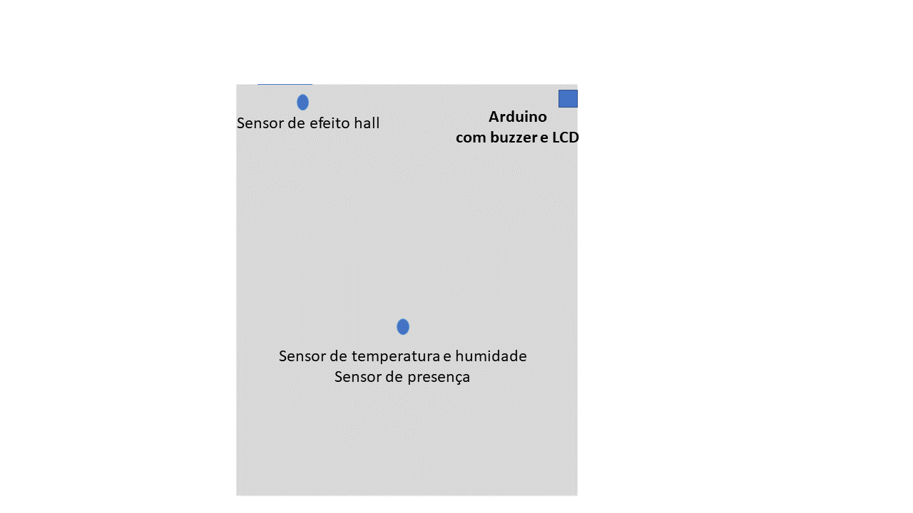

# Proposta de sistema de controle para conforto térmico.

Esta proposta busca utiliza sensores e atuadores para ajudar no controle da temperatura de uma residencia.
Os seguintes sensores são necessários:
- Sensor de movimento;
- Sensor de Umidade/temperatura;
- Sensor de efeito hall magnético;

Esta imagem representa uma sala de uma residencia com os sensores e atuadores do ambiente. O arduino controla um ar condicionado através de um transmissor infra vermelho. O sensor de movimento detecta a presença de pessoas no ambiente para evitar que o ar-condicionado permaneça ligado por longo período na ausência de pessoas. O sensor de efeito hall detecta a abertura da porta indicando a movimentação de pessoas.
